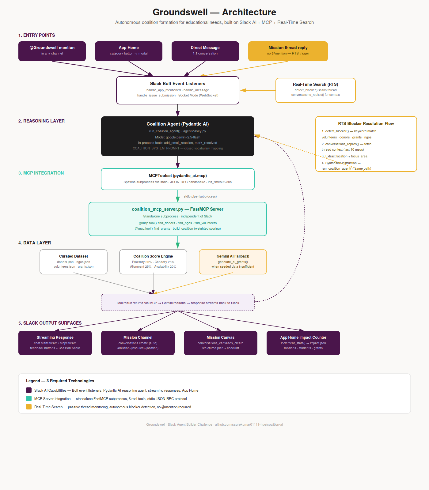

# Groundswell: AI Coalition Agent (Bolt for Python and Pydantic AI)

Meet Groundswell — an AI-powered coalition agent that lives in Slack. Groundswell autonomously assembles donors, NGOs, volunteers, and grants around educational needs, forming mission-driven coalitions in minutes, all without leaving the conversation.



Built with [Bolt for Python](https://docs.slack.dev/tools/bolt-python/) and [Pydantic AI](https://ai.pydantic.dev/) using models from [Google](https://ai.google.dev/), [Anthropic](https://anthropic.com), or [OpenAI](https://openai.com).

## App Overview

Groundswell gives your team four ways to launch educational missions:

* **App Home** — Users open Groundswell's Home tab, view live impact statistics, and choose from need categories (Laptops & Devices, Books & Literacy, STEM Workshops, Mentorship, Other). A modal collects details, then Groundswell posts a coalition summary in a dedicated mission channel.
* **Direct Messages** — Users message Groundswell directly to describe an educational need. Groundswell responds in-thread, maintaining context across follow-ups.
* **Channel @mentions** — Users mention `@Groundswell` in any channel to describe a need and receive a coalition in-thread.
* **Assistant Panel** — Users click _Add Agent_ in Slack, select Groundswell, and pick from suggested prompts or describe a need.

Groundswell connects to the standalone **Coalition MCP Server** to assemble resources in real time:

* **Donor Search (`find_donors`)** — Finds matching donors for the resource type and location.
* **NGO Partner Search (`find_ngos`)** — Identifies NGO partners aligned with the mission focus area.
* **Volunteer Search (`find_volunteers`)** — Surfaces active volunteers with the required skills.
* **Grant Search (`find_grants`)** — Locates available grants by focus area and location.
* **Build Coalition (`build_coalition`)** — Assembles all of the above into a scored, actionable coalition summary.

> **Note:** All MCP tools query a local JSON data layer. In production, these would connect to your live database APIs.

---

## Key Features

### 1. Standalone Coalition MCP Server
The coalition search tools are implemented in `coalition_mcp_server.py` as a standalone Model Context Protocol (MCP) server. Groundswell spawns this server dynamically as a background subprocess using Pydantic AI's `MCPToolset` over stdio transport. This decouples the AI domain logic from the core message routing application.

### 2. Real-Time Blocker Detection
If a user posts about a blocker in an active thread (e.g. volunteer shortage, funding gap, grant needs), Groundswell's blocker detector (`listeners/blocker_detector.py`) intercepts the message. Groundswell then uses targeted MCP tools (like `find_volunteers` or `find_donors`) to suggest solutions in-thread, without re-running the entire coalition algorithm.

### 3. Mission Channels & Canvas
When a new coalition is recommended, Groundswell automatically creates (or reuses) a dedicated public Slack channel (e.g. `#mission-laptops-kanpur`). It posts the coalition summary and initializes a rich **Slack Canvas** containing:
- Mission Overview & launch date.
- Verification status for NGOs and capacity details for donors.
- A progress tracking table with next steps.

### 4. App Home Impact Tracker
The App Home tab acts as a live dashboard (`agent/impact_tracker.py`), displaying:
- Total coalitions created.
- Total active volunteers in the system.
- Aggregated donor capacity (units of resources).
- Active government and private grants discovered.

---

## Setup

Before getting started, make sure you have a development workspace where you have permissions to install apps.

### Developer Program

Join the [Slack Developer Program](https://api.slack.com/developer-program) for exclusive access to sandbox environments for building and testing your apps.

### Create the Slack App

1. Open [https://api.slack.com/apps/new](https://api.slack.com/apps/new) and choose "From an app manifest".
2. Choose the workspace you want to install the application to.
3. Copy the contents of [manifest.json](./manifest.json) into the text box that says `*Paste your manifest code here*` (within the JSON tab) and click _Next_.
4. Review the configuration and click _Create_.
5. Click _Install to Workspace_ and _Allow_.

### Environment Variables

1. Rename `.env.sample` to `.env`.
2. Open your apps setting page from [api.slack.com/apps](https://api.slack.com/apps), click _OAuth & Permissions_, then copy the _Bot User OAuth Token_ into `.env` under `SLACK_BOT_TOKEN`.
3. Click _Basic Information_ and follow the steps in the _App-Level Tokens_ section to create an app-level token with the `connections:write` scope. Copy that token into `.env` as `SLACK_APP_TOKEN`.

```sh
SLACK_BOT_TOKEN=xoxb-YOUR_BOT_TOKEN
SLACK_APP_TOKEN=xapp-YOUR_APP_TOKEN
```

### Python Virtual Environment

```sh
python3 -m venv .venv
source .venv/bin/activate  # on Windows use: .\.venv\Scripts\activate
pip install -r requirements.txt
```

---

## Providers

Groundswell supports Google Gemini, Anthropic Claude, and OpenAI GPT as AI providers. Set at least one API key — Groundswell checks and prioritizes them in the following order:

1. **Google Gemini** (Default: `google:gemini-2.5-flash`)
2. **Anthropic Claude** (Default: `anthropic:claude-3-5-sonnet-latest`)
3. **OpenAI GPT** (Default: `openai:gpt-4o-mini`)

### Google Gemini Setup (Recommended)
1. Generate an API key from the [Google AI Studio Dashboard](https://aistudio.google.com/apikey).
2. Save it to `.env`:
   ```sh
   GOOGLE_API_KEY=YOUR_GOOGLE_API_KEY
   ```

### Anthropic Setup
1. Create an API key from your [Anthropic Console](https://console.anthropic.com/settings/keys).
2. Save it to `.env`:
   ```sh
   ANTHROPIC_API_KEY=YOUR_ANTHROPIC_API_KEY
   ```

### OpenAI Setup
1. Create an API key from your [OpenAI Dashboard](https://platform.openai.com/api-keys).
2. Save it to `.env`:
   ```sh
   OPENAI_API_KEY=YOUR_OPENAI_API_KEY
   ```

---

## Development

### Starting the App Locally

To start the Slack app in Socket Mode:
```sh
python3 app.py
```

### Run Tests

Run the test suite using pytest:
```sh
pytest --tb=short -q
```

### Linting & Formatting

```sh
ruff check
ruff format
```

---

## Deployment

Groundswell is ready for 24/7 cloud deployment. In production (such as on **Railway**), the app runs as a standalone long-running container using Bolt's WebSocket-based Socket Mode.

- **Dockerfile**: Builds a minimal Python container (`python:3.13-slim`), copies the application files, sets up `PYTHONPATH=/app` to ensure local packages resolve correctly, and executes `CMD ["python", "app.py"]`.
- **railway.json**: Configures the Railway environment, ensuring automated process restarts on failure.
- **Environment Config**: Requires `SLACK_BOT_TOKEN`, `SLACK_APP_TOKEN`, and `GOOGLE_API_KEY` (or other provider keys) to be set in the production dashboard variables. No public HTTP endpoints or ngrok tunnels are required.

To deploy manually via the Railway CLI:
```sh
railway link -p <project-id> -s groundswell
railway up
```

---

## Project Structure

### Root Configs
- `manifest.json` — The Slack app manifest for Socket Mode.
- `app.py` — Main entry point for the Socket Mode application.
- `coalition_mcp_server.py` — The standalone FastMCP server containing the resource lookup tools.

### `/listeners`
Every incoming Slack event, action, or view submission is routed to a corresponding listener under this directory:

- **`/listeners/events`** — Slack Events API subscriptions:
  - `app_home_opened.py` — Triggers when a user visits the App Home tab, rendering live impact stats.
  - `app_mentioned.py` — Handles channel `@Groundswell` mentions.
  - `message.py` — Handles direct messages to the bot.
  - `assistant_thread_started.py` — Receives assistant agent launch events.
- **`/listeners/actions`** — Interactive Block Kit actions:
  - `issue_buttons.py` — Launches the need submission modal from App Home.
  - `feedback_buttons.py` — Handles thumbs up/down clicks.
- **`/listeners/views`** — View/Modal submissions:
  - `issue_modal.py` — Processes the submitted need modal and invokes the agent.
- **`/listeners/views` builders**:
  - `app_home_builder.py` — Compiles the App Home tab structure.
  - `issue_modal_builder.py` — Compiles the submission modal.
  - `feedback_builder.py` — Attaches feedback elements to agent responses.
- **`/listeners/utils`**:
  - `mission_channel.py` — Handles creation of channels (e.g. `#mission-laptops-lucknow`) and Canvas setup.
- **`listeners/blocker_detector.py`** — Intercepts chat messages in threads to detect blocker keywords.

### `/agent`
- `casey.py` — Initializes the Pydantic AI `Agent` with system instructions, safety config, model selection, and Slack utility tools (`add_emoji_reaction`, `mark_resolved`).
- `deps.py` — Defines `CaseyDeps` containing the Slack WebClient, channel, and message identifiers.
- `impact_tracker.py` — Queries the local JSON database to compute live metrics for App Home.
- **`/agent/tools`**:
  - `emoji_reaction.py` — Reacts to messages.
  - `mark_resolved.py` — Appends a checkmark reaction to threads.

### `/data`
Contains local JSON database files (`donors.json`, `ngos.json`, `volunteers.json`, `grants.json`) representing the resource database.

### `/thread_context`
- `store.py` — In-memory context store to preserve conversation histories inside Slack threads.
